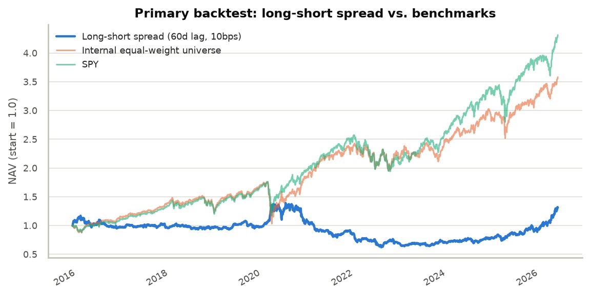
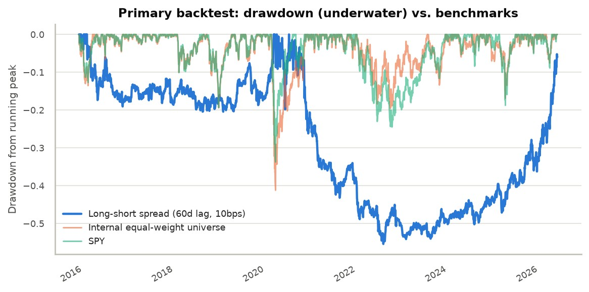
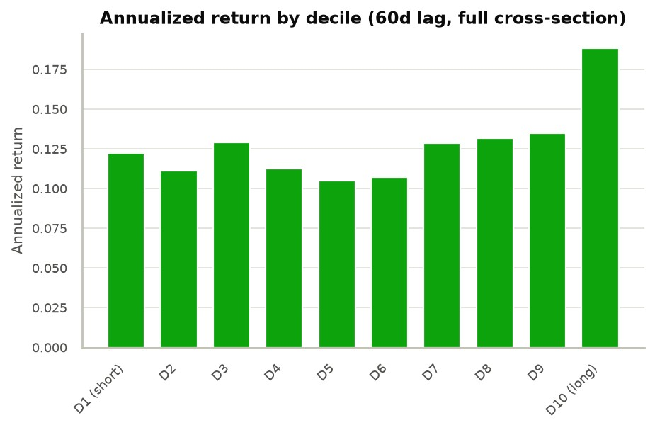

# 13F Ownership Breadth Momentum — Research Memo

## Executive Summary

- **Signal:** rank of the quarter-over-quarter change in the number of distinct 13F filers holding a stock, standardized cross-sectionally within the S&P 500. Grounded in the Miller (1977) short-sale-constraint mechanism and the Chen, Hong & Kubik (2002) empirical link between ownership breadth and returns.
- **Headline result (60-day lag, 10bps):** the long-short spread returns **2.65% annualized, Sharpe 0.15** — versus SPY's 14.99%/0.84 and an internal equal-weight universe benchmark's 12.96%/0.71. It underperforms both benchmarks on every risk-adjusted metric, with a **-55.4% max drawdown** against SPY's -33.7%.
- **Two identified offenders:** turnover of **~77-82% per quarter**, which erodes most of the edge once one-way costs exceed 10bps; and a mechanical **mega-cap tilt** in raw breadth change, concentrated in the short leg, that plausibly explains the drawdown given an 11-year, increasingly mega-cap-led bull market.
- **Verdict:** not tradable as built. Rank-IC is weakly positive at every lag (0.016-0.023) but not statistically significant (t ≈ 0.6-1.1, n=42-43) — too weak to confirm the concept is worthless, too weak to fund as a standalone strategy today. The path forward is refinement, not abandonment.

## Factor Hypothesis

$$
Signal_{i,t} = \text{Rank}\left(\Delta Breadth_{i,t}\right), \qquad \Delta Breadth_{i,t} = Breadth_{i,t} - Breadth_{i,t-1}
$$

$Breadth_{i,t}$ is the count of distinct institutional CIKs reporting a position in security $i$ as of the current formation date; both $Breadth_{i,t}$ and $Breadth_{i,t-1}$ are evaluated as of that same date, not a frozen prior snapshot.

The economic story runs through Miller (1977): a stock's price reflects only the beliefs of investors willing to hold it. When breadth is low, price discovery is dominated by a narrow, more optimistic subset of potential owners — pessimistic information stays excluded because would-be sellers who never bought can't push the price down by staying out. Rising breadth is a direct, observable signal that this constraint is relaxing: more independent institutional views are entering the price, which should on average resolve upward as previously excluded information gets incorporated. Falling breadth is the mirror case. Chen, Hong & Kubik (2002) provide the empirical anchor — the number of mutual fund owners of a stock predicts subsequent returns.

Two adjacent, more obvious alternatives were considered and rejected as the *primary* signal:

- **Value-weighted "smart money" following** (sizing by reported dollar value) conflates a handful of large managers making a concentrated bet with many independent managers each taking a small position — the latter is what the short-sale-constraint story actually predicts (breadth of *independent opinion*, not concentration of capital).
- **Raw concentration** (e.g. Herfindahl index of holder position sizes) answers "how unevenly is this stock held," not "is the pool of holders growing or shrinking" — a related but different question, set aside as a candidate second factor rather than built here.

## Scope Decisions

- **Holder universe:** all 13F filers minus a small, disclosed exclusion list of known passive/index managers (Vanguard, BlackRock, State Street, Geode, Northern Trust, Schwab) — index holdings are mechanical, not a positioning signal. The list is curated, not exhaustive.
- **Equity universe:** S&P 500, point-in-time (not today's constituent list, to avoid survivorship bias) — bounds the CUSIP-mapping problem and the price-history requirement to a tractable, well-covered set.
- **Time window:** the full available history, ~2015-2026, chosen to maximize independent quarterly observations for the honest significance assessment the Results section below requires.
- **Deliberately excluded:** a full historical CUSIP/ticker genealogy (current-ticker resolution only, plus four manually curated overrides for real corporate actions); amendment-type parsing (each 13F-HR/A is treated as a full replacement — SEC's own `AMENDMENTTYPE` semantics are too inconsistent to trust a merge rule against); value-weighting anywhere in the signal or portfolio (equal-weight throughout, to avoid a few mega-caps dominating either); and confidential-treatment-request recovery (the omitted position is fundamentally unrecoverable from public data).

## Methodology

Raw filings are deduplicated first — voting-authority-split rows within a single filing are collapsed before anything downstream sees the data, so one position isn't double-counted as multiple filers.

**Point-in-time discipline** is handled once, at the lowest layer, and every downstream stage inherits it. `pit.as_of_snapshot(panel, period, as_of_date)` defines what's "known" as of any date: for each filer, the most recently *filed* submission (original or amendment) with `FILING_DATE <= as_of_date`. A filer with nothing accepted yet is simply absent — never backfilled once a later filing arrives. This is the literal no-lookahead guarantee, checked directly by a dedicated test suite.

**Formation lag** is a real, disclosed tension rather than an assumption: filings are due 45 days after quarter-end, but empirically only 87.0% arrive by that deadline, 96.3% by day 60, 96.8% by day 90. Rather than pick one lag and hope, the backtest sweeps **45/60/90-day** buffers as three independent, pre-registered runs — this is also the study's primary defense against data-snooping, alongside the transaction-cost grid below.

**Survivorship bias** is controlled by scoring against S&P 500 point-in-time membership, not today's list.

**Factor construction:** $Breadth_{i,t}$ and $Breadth_{i,t-1}$ are both evaluated as of the *current* formation date, not a frozen snapshot of the prior quarter at its own, earlier formation date — by the current date, everything about the prior quarter is already fully public, so using the freshest available data for both terms is the correct point-in-time choice, not lookahead. Names with no prior-quarter breadth (almost always a recent index addition) are dropped, not imputed. Percentile rank is the primary, bounded, outlier-robust standardization; z-score is secondary. One disclosed property: raw change mechanically favors higher-baseline-breadth names (correlation ~0.33-0.37 between prior breadth and both magnitude and rank-extremity of the change) — not "fixed" via a percentage-based version, which has its own worse problem (a name going from 5 to 10 holders reads as "+100%," almost certainly noise). The practical consequence: within the S&P 500, higher baseline breadth skews toward larger-cap names, so this **mega-cap tilt lands disproportionately in the short leg** of the long-short portfolio — the property the Results section below traces through to the drawdown.

**Backtest construction:** quarterly rebalancing on the formation-date schedule; names sorted into **deciles** on `rank_signal`, top decile long / bottom decile short, both **equal-weighted**; positions marked **daily** against real adjusted-close prices, enabling genuine daily-return statistics rather than one number per quarter. **Transaction costs** are swept across **0/5/10/25bps** one-way on turnover. **Benchmarks** are SPY (external) and an internal equal-weight portfolio of the quarter's full resolvable universe (controls for whether the mappable universe is itself a biased slice of the true S&P 500). A quarter enters headline statistics only once its exit has occurred; the most recent, still-open quarter is tracked separately. Missing price data (delisted, renamed, thin coverage) is dropped, not imputed — one concrete bug fixed while building this: the CUSIP→ticker lookup originally resolved Facebook's and BNY Mellon's CUSIPs to their retired tickers (`FB`, `BK`), which have zero price history on Yahoo Finance; fixed by preferring the current-ticker row.

## Results

Full-history backtest on the rebuilt 81.8M-row panel, window **2015-09-30 to 2026-03-31** (~10.5 years, 42-43 quarterly rebalances depending on lag), all 12 combinations of the 45/60/90-day × 0/5/10/25bps grid run to completion. 515 tickers in the price universe; only **4 total** had no usable price data across every closed quarter — the CUSIP-mapping coverage gap disclosed above turned out to be minor in practice. The scored cross-section averaged 370 names/quarter (range 304-428).

**Primary result (60-day lag, 10bps):**

| | Long-short spread | Internal universe (EW) | SPY |
|---|---:|---:|---:|
| Annualized return | **2.65%** | 12.96% | 14.99% |
| Annualized vol | 17.19% | 18.17% | 17.85% |
| Sharpe (rf=0) | **0.15** | 0.71 | 0.84 |
| Max drawdown | **-55.4%** | -41.2% | -33.7% |
| Hit rate (daily) | 52.8% | 54.6% | 55.4% |

This is an honestly weak result, not a positive one dressed up: barely profitable, market-level volatility with none of the market's return, and a drawdown nearly double SPY's. It underperforms even the internal equal-weight benchmark — the portfolio-construction-independent control for "is the mappable universe itself biased" — on every risk-adjusted metric. As built, this is not a standalone long-short strategy an allocator would fund.

**Lag sensitivity is non-monotonic** and does not confirm a front-loaded-decay mechanism. At 10bps: 45-day Sharpe 0.36 (max DD -28.4%), 60-day Sharpe 0.15 (max DD -55.4%), 90-day Sharpe 0.26 (max DD -43.5%). If the short-sale-constraint mechanism were cleanly front-loaded, Sharpe should decay monotonically with lag; instead the middle lag — chosen as primary *before* this sweep ran — is the worst of the three. Read plainly: the sweep is inconclusive on decay, most consistent with lag-to-lag variation being dominated by noise at this sample size (42-43 observations per lag) rather than a clean information-decay curve.

**Cost sensitivity is monotonic, as expected, and the edge is fragile.** At 60-day lag, annualized return falls from 3.92% (0bps) to 3.29% (5bps) to 2.65% (10bps) to **0.76% (25bps)** — Sharpe from 0.23 to 0.04. This tracks directly from turnover: the long and short legs each replace **~77-82% of their names every quarter** (0.766 / 0.817), because sorting on raw, unscaled breadth change is noisy for names near the decile boundary. Above the low end of the disclosed cost grid, transaction costs consume most of the strategy's already-thin edge.

**Rank-IC is weakly positive, not statistically significant at any lag.** Mean Spearman IC of `rank_signal` against realized holding-period return, across the full scored universe: 45-day 0.017, 60-day 0.016, 90-day 0.023 — small and positive, with 56-67% of quarters positive. But IC standard deviation is 5-10x the mean at every lag (60-day: mean 0.016, std 0.158, n=42), giving t-stats around 0.6-1.1 — none clear even the loosest significance threshold.

**The full cross-section is not cleanly monotonic, but the long leg is doing real work.** Average annualized holding-period return across all ten deciles, computed independently of the decile-portfolio construction and its costs: **D10** (highest breadth increase, the actual long leg) returns **18.8%**, clearly the strongest bucket — consistent with the modest positive IC above. **D1** (lowest breadth change, the actual short leg) returns **12.2%**, which is *not* the worst decile (D5, at 10.5%, is) and is still solidly positive. Every single decile was profitable over this window. This sharpens the mechanism: the long leg shows genuine outperformance, but shorting *any* decile — including the one the factor actually selects — was a structural headwind through an 11-year bull market, largely independent of stock selection within the short leg itself.

**Honest noise-vs-signal read.** The decile breakdown refines, rather than overturns, the mega-cap-tilt story disclosed above. Being structurally short a basket for most of 2015-2026 caps the spread's upside almost independent of which names populate that basket, and the disclosed mega-cap tilt (raw breadth change favoring higher-baseline-breadth names) still plausibly explains part of the short leg's own composition and the drawdown's severity. The rank-IC result and the decile check now point the same direction together: a small, non-significant positive tilt survives at the cross-sectional level, and it's concentrated in the long leg specifically (D10's real outperformance), not spread evenly across the sort. **Confidence is low that this specific long-short construction reflects a tradeable edge; confidence that the long side carries some genuine information is higher than confidence in the short side specifically.** The evidence is too weak to declare the underlying concept worthless, but strong enough to say the short leg, not the concept itself, is the more promising place to dig next — a sharper conclusion than the rank-IC alone could support.

*(The most recent quarter, formation 2026-03-31, is still open as of this writing — partial spread NAV -1.6% through 2026-05-30, tracked separately and correctly excluded from all statistics above.)*

## Next Steps

1. **Reduce turnover first** — the one unambiguous, non-noisy result in this memo. ~80%/quarter turnover consumes 3.16 of 3.92 points of annualized return between 0bps and 25bps, independent of whether the underlying signal is real. A hysteresis rule (only exit a position once it falls outside the top/bottom 15%, not exactly the decile boundary) or a 2-quarter smoothed signal would directly test whether that turnover is genuine signal turnover or boundary noise — resolvable with data already on hand.
2. **Test a scale-neutralized signal variant, focused on the short leg specifically** — the decile breakdown above already shows the long leg (D10) doing real work while the short leg (D1) is merely mediocre, not genuinely weak, so a percentage- or baseline-breadth-adjusted version of `raw_change`, run through the identical backtest machinery, is the most direct test of whether a better-constructed short leg (not a different long leg) closes the gap to the weakly-positive IC.
3. **Re-run the lag sweep at finer granularity** (30/45/60/75/90 days) before drawing any conclusion about decay — the current 3-point sweep was non-monotonic and each point rests on only 42-43 observations. Cheapest of the three: identical pipeline, no new data, no new signal logic.

Deferred, not prioritized: extending the equity universe beyond the S&P 500 and building a full CUSIP/ticker genealogy would improve coverage but are unlikely to be the first-order explanation for this backtest's weak result — the coverage gap measured only 4 dropped tickers total, far too small to explain a -55% max drawdown or a nonsignificant IC.
