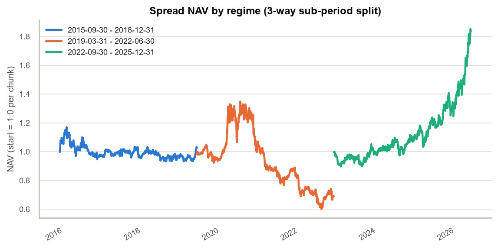

# 13F Ownership Breadth Momentum — Research Memo

## Executive Summary

- **Signal:** rank of the quarter-over-quarter change in the number of distinct 13F filers holding a stock, standardized cross-sectionally within the S&P 500. Grounded in the Miller (1977) short-sale-constraint mechanism and the Chen, Hong & Kubik (2002) empirical link between ownership breadth and returns.
- **Headline result (60-day lag, 10bps):** the long-short spread returns **2.65% annualized, Sharpe 0.15** — versus SPY's 14.99%/0.84 and an internal equal-weight universe benchmark's 12.96%/0.71. It underperforms both benchmarks on every risk-adjusted metric, with a **-55.4% max drawdown** against SPY's -33.7%.
- **Two identified offenders:** turnover of **~77-82% per quarter**, which erodes most of the edge once one-way costs exceed 10bps; and a short-side breakdown concentrated in one identifiable, verified regime (2019Q1-2022Q2) — during it, the short leg alone cost -55.7% of contribution while the long leg gained +30.9%, driven by institutions still fleeing COVID-abandoned energy/travel/apparel names in Q3 2020 even as those names' prices had already rallied 40-97%, confirmed directly against the raw 13F filings.
- **Verdict:** not tradable as built. Rank-IC is weakly positive at every lag (0.016-0.023) but not statistically significant (t ≈ 0.6-1.1, n=42-43) — too weak to confirm the concept is worthless, too weak to fund as a standalone strategy today. The path forward is refinement, not abandonment.

## Factor Hypothesis

$$
Signal_{i,t} = \text{Rank}\left(\Delta Breadth_{i,t}\right), \qquad \Delta Breadth_{i,t} = Breadth_{i,t} - Breadth_{i,t-1}
$$

$Breadth_{i,t}$ is the count of distinct institutional CIKs reporting a position in security $i$ as of the current formation date; both $Breadth_{i,t}$ and $Breadth_{i,t-1}$ are evaluated as of that same date, not a frozen prior snapshot.

The economic story runs through Miller (1977): a stock's price reflects only the beliefs of investors willing to hold it. When breadth is low, price discovery is dominated by a narrow, more optimistic subset of potential owners — pessimistic information stays excluded because would-be sellers who never bought can't push the price down by staying out. Rising breadth is a direct, observable signal that this constraint is relaxing: more independent institutional views are entering the price, which should on average resolve upward as previously excluded information gets incorporated. Falling breadth is the mirror case. Chen, Hong & Kubik (2002) provide the empirical anchor — the number of mutual fund owners of a stock predicts subsequent returns.

Two adjacent, more obvious alternatives were considered and rejected as the *primary* signal:

- **Value-weighted "smart money" following** (sizing by reported dollar value) conflates a handful of large managers making a concentrated bet with many independent managers each taking a small position — the latter is what the short-sale-constraint story actually predicts (breadth of *independent opinion*, not concentration of capital).
- **Raw concentration** (e.g. Herfindahl index of holder position sizes) answers "how unevenly is this stock held," not "is the pool of holders growing or shrinking" — a related but different question, set aside as a candidate second factor rather than built here.

## Scope Decisions

- **Holder universe:** all 13F filers minus a small, disclosed exclusion list of known passive/index managers (Vanguard, BlackRock, State Street, Geode, Northern Trust, Schwab) — index holdings are mechanical, not a positioning signal. The list is curated, not exhaustive.
- **Equity universe:** S&P 500, point-in-time (not today's constituent list, to avoid survivorship bias) — bounds the CUSIP-mapping problem and the price-history requirement to a tractable, well-covered set.
- **Time window:** the full available history, ~2015-2026, chosen to maximize independent quarterly observations for the honest significance assessment the Results section below requires.
- **Deliberately excluded:** a full historical CUSIP/ticker genealogy (current-ticker resolution only, plus four manually curated overrides for real corporate actions); amendment-type parsing (each 13F-HR/A is treated as a full replacement — SEC's own `AMENDMENTTYPE` semantics are too inconsistent to trust a merge rule against); value-weighting anywhere in the signal or portfolio (equal-weight throughout, to avoid a few mega-caps dominating either); and confidential-treatment-request recovery (the omitted position is fundamentally unrecoverable from public data).

## Methodology

Raw filings are deduplicated first — voting-authority-split rows within a single filing are collapsed before anything downstream sees the data, so one position isn't double-counted as multiple filers.

**Point-in-time discipline** is handled once, at the lowest layer, and every downstream stage inherits it. `pit.as_of_snapshot(panel, period, as_of_date)` defines what's "known" as of any date: for each filer, the most recently *filed* submission (original or amendment) with `FILING_DATE <= as_of_date`. A filer with nothing accepted yet is simply absent — never backfilled once a later filing arrives. This is the literal no-lookahead guarantee, checked directly by a dedicated test suite.

**Formation lag** is a real, disclosed tension rather than an assumption: filings are due 45 days after quarter-end, but empirically only 87.0% arrive by that deadline, 96.3% by day 60, 96.8% by day 90. Rather than pick one lag and hope, the backtest sweeps **45/60/90-day** buffers as three independent, pre-registered runs — this is also the study's primary defense against data-snooping, alongside the transaction-cost grid below.

**Survivorship bias** is controlled by scoring against S&P 500 point-in-time membership, not today's list.

**Factor construction:** $Breadth_{i,t}$ and $Breadth_{i,t-1}$ are both evaluated as of the *current* formation date, not a frozen snapshot of the prior quarter at its own, earlier formation date — by the current date, everything about the prior quarter is already fully public, so using the freshest available data for both terms is the correct point-in-time choice, not lookahead. Names with no prior-quarter breadth (almost always a recent index addition) are dropped, not imputed. Percentile rank is the primary, bounded, outlier-robust standardization; z-score is secondary. One disclosed property: raw change mechanically favors higher-baseline-breadth names (correlation ~0.33-0.37 between prior breadth and both magnitude and rank-extremity of the change) — not "fixed" via a percentage-based version, which has its own worse problem (a name going from 5 to 10 holders reads as "+100%," almost certainly noise). The practical consequence: within the S&P 500, higher baseline breadth skews toward larger-cap names, so this **mega-cap tilt lands disproportionately in the short leg** of the long-short portfolio — one contributing property to the short-leg risk the Results section below traces through to a more specific, verified mechanism.

**Backtest construction:** quarterly rebalancing on the formation-date schedule; names sorted into **deciles** on `rank_signal`, top decile long / bottom decile short, both **equal-weighted**; positions marked **daily** against real adjusted-close prices, enabling genuine daily-return statistics rather than one number per quarter. **Transaction costs** are swept across **0/5/10/25bps** one-way on turnover. **Benchmarks** are SPY (external) and an internal equal-weight portfolio of the quarter's full resolvable universe (controls for whether the mappable universe is itself a biased slice of the true S&P 500). A quarter enters headline statistics only once its exit has occurred; the most recent, still-open quarter is tracked separately. Missing price data (delisted, renamed, thin coverage) is dropped, not imputed — one concrete bug fixed while building this: the CUSIP→ticker lookup originally resolved Facebook's and BNY Mellon's CUSIPs to their retired tickers (`FB`, `BK`), which have zero price history on Yahoo Finance; fixed by preferring the current-ticker row.

## Results

Full-history backtest on the rebuilt 81.8M-row panel, window **2015-09-30 to 2026-03-31** (~10.5 years, 42-43 quarterly rebalances depending on lag), all 12 combinations of the 45/60/90-day × 0/5/10/25bps grid run to completion. 515 tickers in the price universe; only **4 total** had no usable price data across every closed quarter — the CUSIP-mapping coverage gap disclosed above turned out to be minor in practice. The scored cross-section averaged 370 names/quarter (range 304-428).

**Primary result (60-day lag, 10bps):**

| | Long-short spread | Internal universe (EW) | SPY |
|---|---:|---:|---:|
| Annualized return | **2.65%** | 12.96% | 14.99% |
| Annualized vol | 17.19% | 18.17% | 17.85% |
| Sharpe (rf=0) | **0.15** | 0.71 | 0.84 |
| Max drawdown | **-55.4%** | -41.2% | -33.7% |
| Hit rate (daily) | 52.8% | 54.6% | 55.4% |

This is an honestly weak result, not a positive one dressed up: barely profitable, market-level volatility with none of the market's return, and a drawdown nearly double SPY's. It underperforms even the internal equal-weight benchmark — the portfolio-construction-independent control for "is the mappable universe itself biased" — on every risk-adjusted metric. As built, this is not a standalone long-short strategy an allocator would fund.

**The drawdown is not spread across the sample — it is one 3.25-year regime.** Splitting the primary lag's closed quarters into three roughly-equal sub-periods: 2015Q3-2018Q4 is flat (Sharpe 0.08); **2019Q1-2022Q2 loses 30.7% (Sharpe -0.48, mean rank-IC -0.036), and this window's own max drawdown is the full-sample -55.4%**; 2022Q3-2025Q4 recovers sharply (+84.2%, Sharpe 1.14, mean IC +0.049). Outside the middle window, the strategy never has a comparably bad stretch.

Per-ticker attribution, sign-adjusted for the short leg (a short position that rises subtracts from spread return, not adds), shows the short leg — not the long leg — did the damage: over 2019Q1-2022Q2, long-leg contribution is **+30.9%**, short-leg is **-55.7%**; narrowed to 2020-2021 alone, the short leg cost **-70.6%** by itself. The worst names (TPR, COTY, UAA, UA, FANG, OXY, XOM, VLO, MPC, WFC, AIG, DVN — all shorted, all up 36-97% in Q2-Q3 2020) are exactly the apparel/travel/energy names institutions fled hardest in the COVID crash.

Verified directly against the raw 13F panel, not inferred from price action: institutional breadth for these exact names was still falling in Q3 2020 (e.g. COTY 348→317→288→251, OXY 1018→795→719→666, quarter-over-quarter from 2019Q4) — the same quarter their prices had already rallied 40-97%. Mechanism: 13F-derived breadth lags institutional sentiment (quarterly filings, 45-90 day disclosure lag on top); during a violent V-shaped recovery, price leads observable institutional re-entry by more than the formation lag absorbs, so the signal correctly detects genuine abandonment and shorts it right as the reversal begins pricing in. The recovery regime is the mirror image, and it is real, current alpha: its long leg (+106.4% contribution) correctly rode the 2023-2025 AI/semiconductor supercycle (SNDK, MU, NVDA, AVGO, WDC, AMD, INTC, LRCX, AMAT).

**Lag sensitivity is non-monotonic full-sample, but the regime breakdown above explains part of it.** At 10bps: 45-day Sharpe 0.36 (max DD -28.4%), 60-day Sharpe 0.15 (max DD -55.4%), 90-day Sharpe 0.26 (max DD -43.5%) — the middle lag, chosen as primary *before* this sweep ran, is the worst of the three, which would look like pure noise in isolation. But within the 2019Q1-2022Q2 window specifically, 45-day lag lost only 5.7% (Sharpe -0.09) against 60-day's 30.7% (Sharpe -0.48) — less lag, less time for price to run ahead of the signal in exactly the regime that breaks it. That is a mechanistic explanation for part of the full-sample pattern, not a full resolution of it (90-day, at -19.8%/Sharpe -0.30 in the same window, does not fit a clean monotonic story either) — worth a finer sweep (Next Steps) before treating either reading as final.

**Cost sensitivity is monotonic, as expected, and the edge is fragile.** At 60-day lag, annualized return falls from 3.92% (0bps) to 3.29% (5bps) to 2.65% (10bps) to **0.76% (25bps)** — Sharpe from 0.23 to 0.04. This tracks directly from turnover: the long and short legs each replace **~77-82% of their names every quarter** (0.766 / 0.817), because sorting on raw, unscaled breadth change is noisy for names near the decile boundary. Above the low end of the disclosed cost grid, transaction costs consume most of the strategy's already-thin edge.

**Rank-IC is weakly positive, not statistically significant at any lag.** Mean Spearman IC of `rank_signal` against realized holding-period return, across the full scored universe: 45-day 0.017, 60-day 0.016, 90-day 0.023 — small and positive, with 56-67% of quarters positive. But IC standard deviation is 5-10x the mean at every lag (60-day: mean 0.016, std 0.158, n=42), giving t-stats around 0.6-1.1 — none clear even the loosest significance threshold.

**The full-sample cross-section corroborates the regime finding.** Average annualized holding-period return across all ten deciles, independent of the decile-portfolio construction and its costs: **D10** (the actual long leg) returns **18.8%**, clearly the strongest bucket; **D1** (the actual short leg) returns **12.2%** — *not* the worst decile (D5, 10.5%, is) and still solidly positive, consistent with a short leg that is structurally weak, not uniquely broken, outside its one bad regime.

**Honest noise-vs-signal read.** The regime and attribution findings above sharpen, not replace, the mega-cap-tilt and decile findings: the long leg shows genuine, currently-working information content (D10's real outperformance, the 2022-2025 semiconductor recovery); the short leg is where confidence is lowest, and now for a specific, verified reason — a structural lag between 13F-observable sentiment and price during violent reversals, not merely "shorting a positive-returning bucket in a bull market." **Confidence is low that this specific long-short construction reflects a tradeable edge; confidence that the long side carries genuine information is meaningfully higher than confidence in the short side.** The evidence is too weak to declare the underlying concept worthless, but strong enough to say the short leg's construction — not the breadth-momentum concept itself — is both the main culprit and the most promising place to fix.

*(The most recent quarter, formation 2026-03-31, is still open as of this writing — partial spread NAV -1.6% through 2026-05-30, tracked separately and correctly excluded from all statistics above.)*

## Next Steps

1. **Reduce turnover first** — the one unambiguous, non-noisy result in this memo. ~80%/quarter turnover consumes 3.16 of 3.92 points of annualized return between 0bps and 25bps, independent of whether the underlying signal is real. A hysteresis rule (only exit a position once it falls outside the top/bottom 15%, not exactly the decile boundary) or a 2-quarter smoothed signal would directly test whether that turnover is genuine signal turnover or boundary noise — resolvable with data already on hand.
2. **Add a regime-conditional short-side filter, motivated directly by the verified failure mechanism** — the short leg's damage is concentrated in violent market reversals where price leads observable 13F re-entry (confirmed against real breadth data, not assumed), so a rule that reduces or suspends short exposure following a sharp aggregate drawdown (a realized-vol or market-drawdown trigger) targets the actual failure mode directly. A scale-neutralized version of `raw_change` (percentage- or baseline-breadth-adjusted) remains a useful secondary test of the short leg's composition, but the regime-conditional filter is the more direct fix given what this post-mortem found.
3. **Re-run the lag sweep at finer granularity** (30/45/60/75/90 days), now specifically informed by the regime finding — within the bad window, shorter lag clearly helped (45-day lost 5.7% vs. 60-day's 30.7%), but the full-sample sweep is still non-monotonic and each point rests on only 42-43 observations. A finer grid tests whether that within-regime pattern generalizes or was itself a one-window coincidence.

Deferred, not prioritized: extending the equity universe beyond the S&P 500 and building a full CUSIP/ticker genealogy would improve coverage but are unlikely to be the first-order explanation for this backtest's weak result — the coverage gap measured only 4 dropped tickers total, far too small to explain a -55% max drawdown or a nonsignificant IC.
